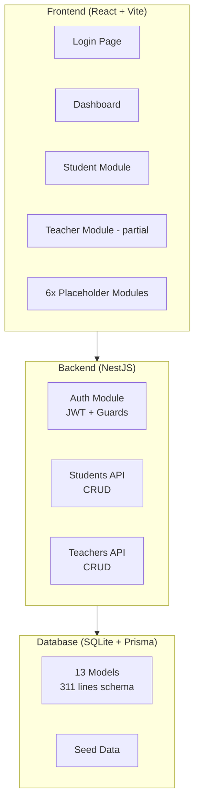

# 📊 Status Pengembangan SekolahERP

## Ringkasan

Aplikasi **SekolahERP** saat ini berada di **Phase 1 (MVP)** — dan sudah **hampir selesai** untuk fase ini. Fondasi utama sudah terbangun dengan baik di sisi frontend maupun backend.

---

## ✅ Yang Sudah Selesai (Phase 1 MVP)

### Frontend (React + Vite + TypeScript)

| Komponen | Status | File Utama |
|----------|--------|------------|
| **Login Page** | ✅ Selesai | [LoginPage.tsx](file:///c:/Users/Administrator/.gemini/antigravity/scratch/sekolah-erp/src/modules/auth/pages/LoginPage.tsx) (12.6 KB) |
| **Admin Dashboard** | ✅ Selesai | [AdminDashboard.tsx](file:///c:/Users/Administrator/.gemini/antigravity/scratch/sekolah-erp/src/modules/dashboard/pages/AdminDashboard.tsx) (20.7 KB) |
| **Manajemen Siswa** | ✅ Selesai | List, Detail, Form (3 halaman) |
| **Sidebar & Header** | ✅ Selesai | [Sidebar.tsx](file:///c:/Users/Administrator/.gemini/antigravity/scratch/sekolah-erp/src/components/layouts/Sidebar.tsx), [Header.tsx](file:///c:/Users/Administrator/.gemini/antigravity/scratch/sekolah-erp/src/components/layouts/Header.tsx) |
| **UI Component Library** | ✅ Selesai | 8 komponen (Button, Card, Badge, Form, Input, Label, Select, Tabs) |
| **Auth Store (Zustand)** | ✅ Selesai | State management untuk autentikasi |
| **Dark/Light Theme** | ✅ Selesai | Toggle tersedia di header |
| **Bilingual (ID/EN)** | ✅ Selesai | [translations.ts](file:///c:/Users/Administrator/.gemini/antigravity/scratch/sekolah-erp/src/constants/translations.ts) (10.9 KB) |
| **RBAC Permissions** | ✅ Selesai | [permission.types.ts](file:///c:/Users/Administrator/.gemini/antigravity/scratch/sekolah-erp/src/types/permission.types.ts), [usePermission.ts](file:///c:/Users/Administrator/.gemini/antigravity/scratch/sekolah-erp/src/hooks/usePermission.ts) |
| **Protected Routes** | ✅ Selesai | Route guards di [index.tsx](file:///c:/Users/Administrator/.gemini/antigravity/scratch/sekolah-erp/src/routes/index.tsx) |
| **Mock Data** | ✅ Selesai | [mock-data.ts](file:///c:/Users/Administrator/.gemini/antigravity/scratch/sekolah-erp/src/constants/mock-data.ts) (9.2 KB) |
| **API Client** | ✅ Selesai | [api.client.ts](file:///c:/Users/Administrator/.gemini/antigravity/scratch/sekolah-erp/src/services/api.client.ts) (Axios + interceptors) |

### Backend (NestJS + Prisma + SQLite)

| Komponen | Status | Detail |
|----------|--------|--------|
| **Database Schema** | ✅ Selesai | [schema.prisma](file:///c:/Users/Administrator/.gemini/antigravity/scratch/sekolah-erp/server/prisma/schema.prisma) — 11 model (311 baris) |
| **Auth Module** | ✅ Selesai | Controller, Service, Guards, Strategies, Decorators |
| **Students Module** | ✅ Selesai | Controller, Service (CRUD) |
| **Teachers Module** | ✅ Selesai | Controller, Service (CRUD) |
| **Prisma Service** | ✅ Selesai | Database connection layer |
| **Seed Data** | ✅ Selesai | [seed.ts](file:///c:/Users/Administrator/.gemini/antigravity/scratch/sekolah-erp/server/prisma/seed.ts) |
| **Vercel Config** | ✅ Selesai | [vercel.json](file:///c:/Users/Administrator/.gemini/antigravity/scratch/sekolah-erp/vercel.json) |

### Database Models (Prisma)

```
School, AcademicYear, Semester, User, RefreshToken, AuditLog,
Student, StudentParent, StudentEconomic, Attendance,
Teacher, Class, Announcement
```

---

## 🔨 Dalam Pengembangan Awal (Parsial)

| Komponen | Status | Keterangan |
|----------|--------|------------|
| **Data Guru (Frontend)** | 🔨 Parsial | [TeacherListPage.tsx](file:///c:/Users/Administrator/.gemini/antigravity/scratch/sekolah-erp/src/modules/teachers/pages/TeacherListPage.tsx) ada tapi routing masih ke placeholder |

---

## 🚧 Belum Dimulai (Phase 2-4) — Masih Placeholder

Semua modul berikut masih berupa **halaman placeholder** di [placeholder-pages.tsx](file:///c:/Users/Administrator/.gemini/antigravity/scratch/sekolah-erp/src/routes/placeholder-pages.tsx):

| Modul | Route | Fase Rencana |
|-------|-------|-------------|
| **Guru (full)** | `/teachers/*` | Phase 2 |
| **Keuangan** | `/finance/*` | Phase 2-3 |
| **Jadwal Pelajaran** | `/schedules/*` | Phase 2 |
| **Inventaris** | `/inventory/*` | Phase 3 |
| **Administrasi** | `/admin/*` | Phase 3 |
| **Beasiswa/PIP** | `/scholarships/*` | Phase 3-4 |
| **Laporan** | `/reports/*` | Phase 3-4 |
| **Pengaturan** | `/settings/*` | Phase 4 |

---

## 📐 Arsitektur & Infrastruktur



---

## 📝 Kesimpulan

| Aspek | Penilaian |
|-------|-----------|
| **Fase saat ini** | **Phase 1 MVP — ~90% selesai** |
| **Frontend** | Kuat — 6 halaman fungsional + 8 halaman placeholder |
| **Backend** | Fondasi solid — 3 modul API (Auth, Students, Teachers) |
| **Database** | Lengkap untuk Phase 1 — 13 model terstruktur |
| **UI/UX** | Premium — tema gelap/terang, animasi, responsive |
| **Yang kurang untuk Phase 1** | Integrasi penuh frontend ↔ backend (beberapa page mungkin masih pakai mock data) |

> [!TIP]
> Langkah berikutnya yang disarankan:
> 1. **Selesaikan modul Guru** — halaman sudah ada tapi belum di-route
> 2. **Integrasi frontend ↔ backend** — pastikan semua CRUD terhubung ke API
> 3. **Mulai Phase 2** — Keuangan dan Jadwal Pelajaran
